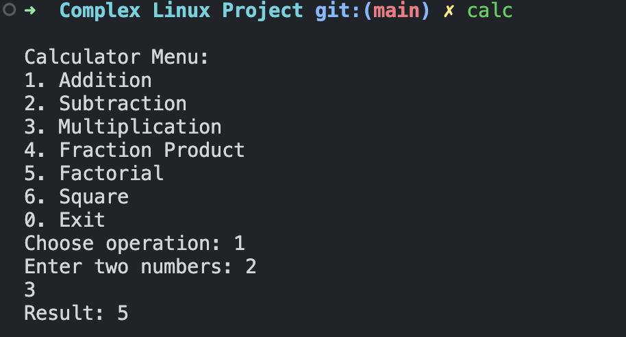
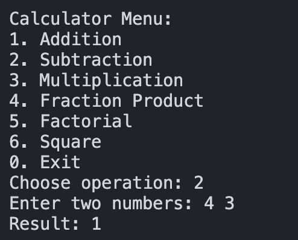

This project contains multiple C programs, including a calculator and a text transformer.

## Installation Instructions
1. Build the project:
   ```
   make
   ```
2. Install the programs (requires root privileges):
   ```
   sudo make install
   ```

## Cleaning Instructions
1. Clean build files:
   ```
   make clean
   ```

## Screenshots of program execution

 
 
